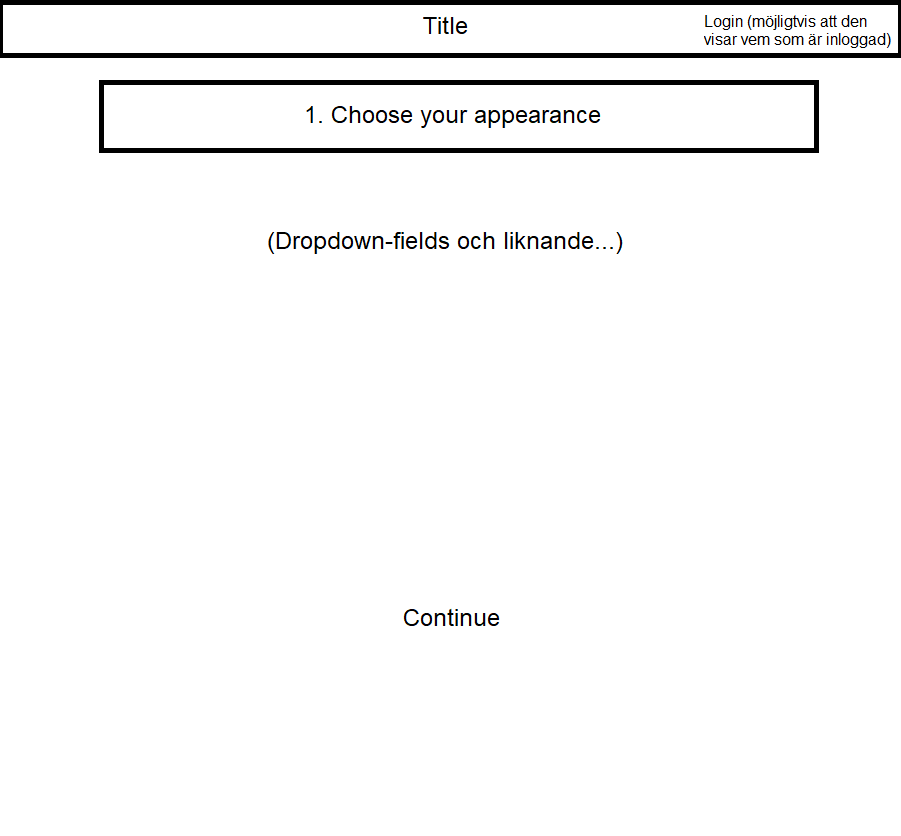
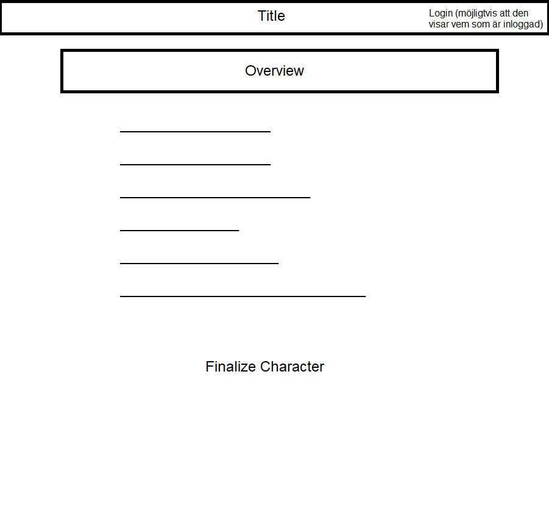
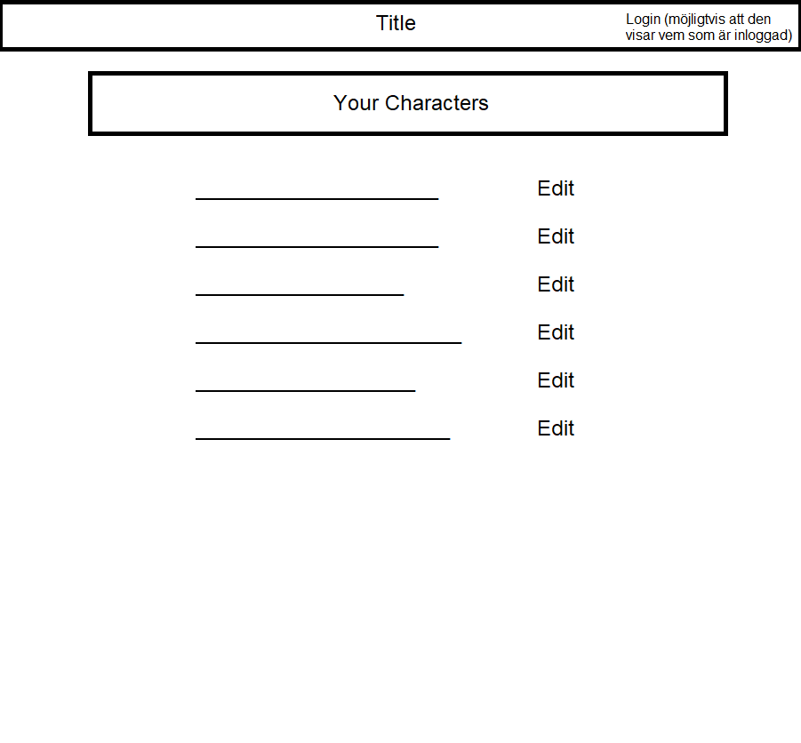
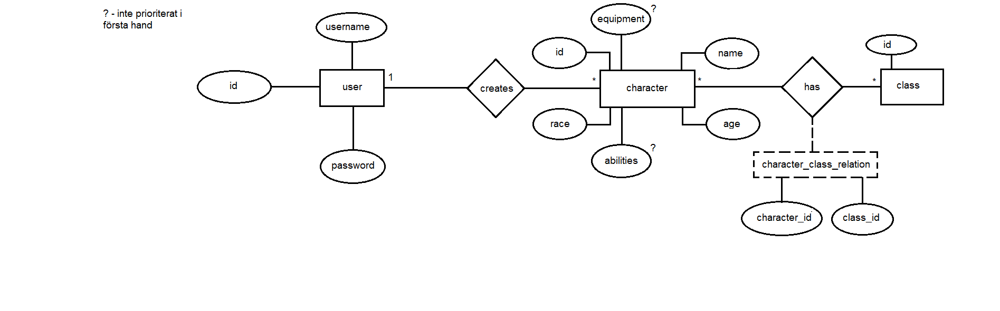

# Projektplan

## 1. Projektbeskrivning (Beskriv vad sidan ska kunna göra).
Sidan ska vara en designer för rollspelskaraktärer. En användare kommer kunna skapa flera karaktärer med anpassningsbara egenskaper och attribut. När man skapar en ny karaktär går man igenom en sekvens för att fullborda karaktären. Det ska finnas möjlighet att redigera efter att man är klar.
## 2. Vyer (visa bildskisser på dina sidor).

## 3. Databas med ER-diagram (Bild på ER-diagram).

## 4. Arkitektur (Beskriv filer och mappar - vad gör/innehåller de?).
views/creator/index.slim - Huvudsidan där användarens karaktärer och deras egenskaper presenteras. Ytterligare funktioner ska finnas som t.ex. Delete samt Update för varje karaktär. Det går även att klicka på en knapp vilket gör att man går till views/creator/new.slim. 

views/creator/new.slim - Sidan där användaren fyller i ett formulär för att skapa en ny karaktär. Datan presenteras under views/creator/index.slim.

views/layout.slim - Standard template/layout HTML för varje sida. Innehåller titeln på applikationen, register- samt loginlänk.

views/login.slim - Login-formulär, använder användarnamn samt tillhörande lösenord.

views/register.slim - Register-formulär, registrerar användarnamn samt tillhörande lösenord (måste skrivas en extra gång).

app.rb - Rubyfil för allt som är SQL-kod och ruby-kod. Kopplar ihop webbsidan och dess funktioner till databasen. T.ex. användare, karaktärer, delete och update.

public/css/mystyle.css - CSS-fil som gör att det blir lättare att navigera och ta in information från webbsidan.