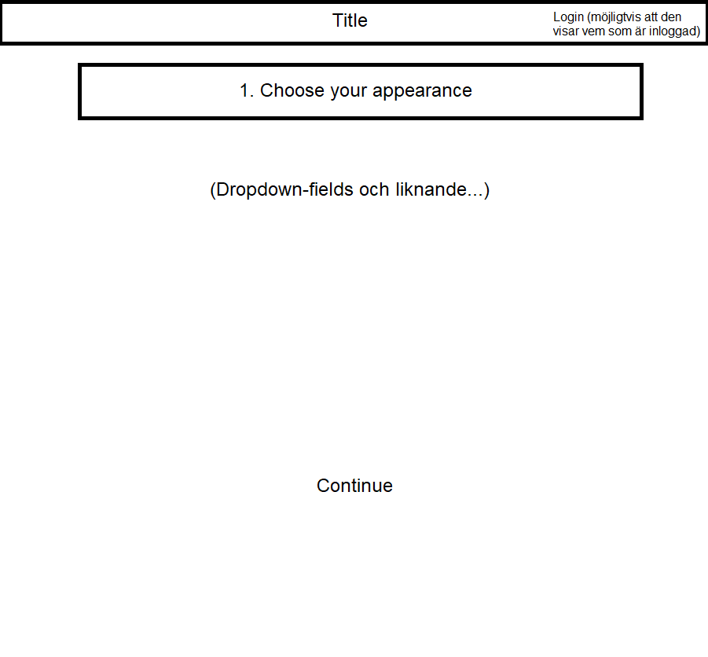
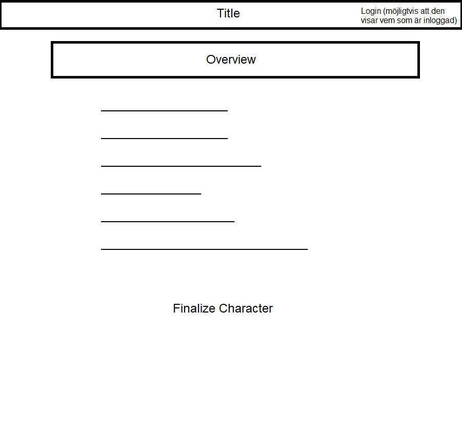
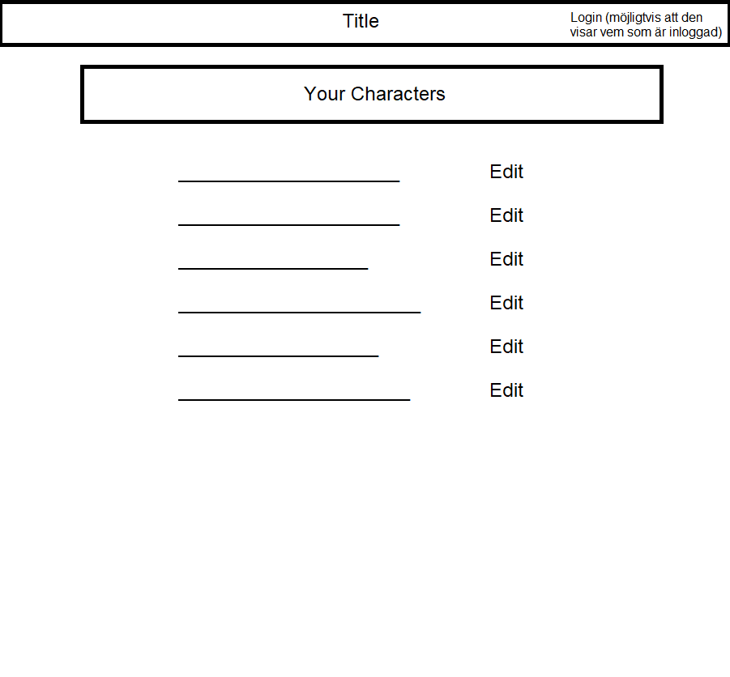

# Projektplan

## 1. Projektbeskrivning (Beskriv vad sidan ska kunna göra).
Sidan ska vara en designer för rollspelskaraktärer. En användare kommer kunna skapa flera karaktärer med anpassningsbara egenskaper.
## 2. Vyer (visa bildskisser på dina sidor).

## 3. Databas med ER-diagram (Bild på ER-diagram).

## 4. Arkitektur (Beskriv filer och mappar - vad gör/innehåller de?).

