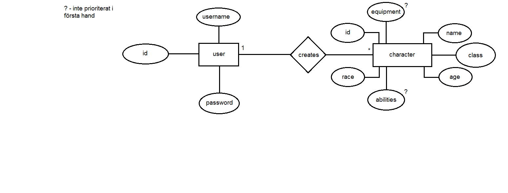

# Projektplan

## 1. Projektbeskrivning (Beskriv vad sidan ska kunna göra).
Sidan ska vara en designer för rollspelskaraktärer. En användare kommer kunna skapa flera karaktärer med anpassningsbara egenskaper och attribut. När man skapar en ny karaktär går man igenom en sekvens för att fullborda karaktären. Det ska finnas möjlighet att redigera efter att man är klar.
## 2. Vyer (visa bildskisser på dina sidor).

## 3. Databas med ER-diagram (Bild på ER-diagram).

## 4. Arkitektur (Beskriv filer och mappar - vad gör/innehåller de?).

